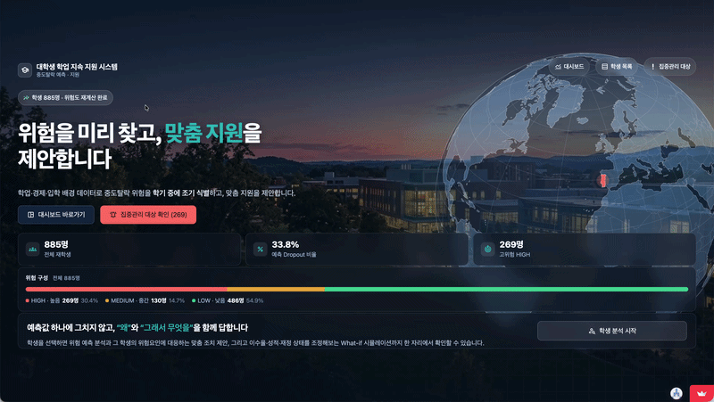
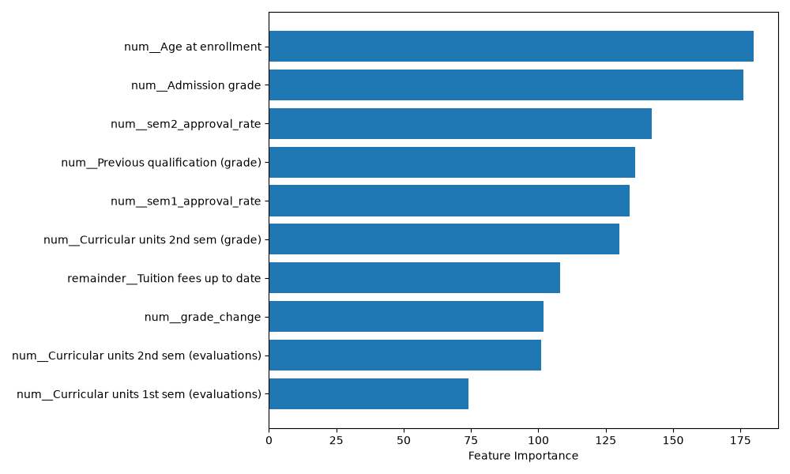

# Dropout Insight: 대학생 중도 자퇴 예측 및 맞춤 대응 전략



## 목차
- [1. 프로젝트 개요](#1-프로젝트-개요)
- [2. 팀 소개](#2-팀-소개)
- [3. 프로젝트 구조](#3-프로젝트-구조)
- [4. 개발 환경](#4-개발-환경)
- [5. 설치 및 실행 방법](#5-설치-및-실행-방법)
- [6. 데이터 구성](#6-데이터-구성)
- [7. 데이터 전처리](#7-데이터-전처리)
- [8. 평가 지표](#8-평가-지표)
- [9. 결과](#9-결과)
- [10. Streamlit 서비스](#10-streamlit-서비스)
- [11. Git 협업 규칙](#11-git-협업-규칙)
- [12. 모델 및 데이터 파일 규칙](#12-모델-및-데이터-파일-규칙)
- [13. 회고](#13-회고)

---

## 1. 프로젝트 개요

**프로젝트 명**: 대학생 중도 자퇴 예측 및 맞춤 대응 전략

**프로젝트 소개**

UCI "Predict Students' Dropout and Academic Success" 데이터셋(4,424명 규모)을 기반으로, 학생의 인구통계·사회경제적 배경·1·2학기 학업 성과 데이터를 분석하여 중도 자퇴(Dropout) 여부를 예측하는 프로젝트입니다.

- EDA를 통해 자퇴에 실질적으로 영향을 주는 변수(학기별 성적·이수과목 수, 등록금 완납 여부, 나이 등)와 상대적으로 영향이 적은 변수(국적, 특수교육 대상 여부 등)를 구분합니다.
- 데이터 전처리(결측치 확인, 파생변수 생성, 범주형 그룹화·인코딩, 스케일링)를 거쳐 여러 머신러닝/딥러닝 모델(Logistic Regression, Random Forest, XGBoost, LightGBM, MLP)의 성능을 비교합니다.
- 최종적으로 성능이 가장 우수한 모델(LightGBM)을 선정하고, Streamlit 서비스에 실제 연동하여 학생 데이터 입력 시 자퇴 위험도를 예측할 수 있도록 합니다.

**프로젝트 목표**

- 데이터 정제 및 분석
  - 결측치·중복행 확인(원본 데이터 자체는 결측치 0건), 컬럼명 정리, 파생변수 생성(1학기 0과목 등록 플래그, 학기별 이수율, 성적 변화량, 재정 위험도 점수 등)
  - EDA를 통한 변수별 Dropout 영향력 분석 (범주형 교차분석, 수치형 상관관계 분석)
  - 고카디널리티 범주형 변수(전공, 지원 전형, 부모 학력/직업)의 그룹화 및 한글 라벨링
- 머신러닝·딥러닝 모델 비교
  - Logistic Regression, Random Forest, XGBoost, LightGBM(머신러닝) + MLP(TensorFlow/Keras, 딥러닝) 다중 모델 비교
  - 클래스 불균형(Dropout 32.12% : Non-Dropout 67.88%)을 고려한 평가 지표 설정
- 결과 확인 및 분석
  - 모델별 성능 비교 (F1-score, Recall, Precision, ROC-AUC 등)
  - 자퇴에 영향을 미치는 핵심 요인 도출 및 맞춤 대응 전략(재정지원 그룹 vs 학습지원 그룹 세그먼트 등) 제안
- 서비스 구현
  - Streamlit 5개 화면(시작 / 대시보드 / 학생 목록 / 집중관리 대상 / 예비학생 예측) 구현 및 실제 모델 연동

---

## 2. 팀 소개

👥 **팀원**

| 역할 | 담당 | 주요 업무 |
| --- | --- | --- |
| **1. PM·서비스 통합** | 조현주 | 전체 산출물 취합, PPT 총괄, LightGBM·MLP 모델링, 모델 성능 지표 취합(model_metrics.json) |
| **2. 데이터 전처리·EDA** | 박수휘 | 품질점검, EDA, 결측/이상치 처리, Target 정의 근거 마련, 범주 일반화(Model B), 전처리 결과서 |
| **3. 모델링 A (ML 계열 1)** | 고은하 | Logistic Regression + Random Forest 학습·튜닝, 변수중요도 분석 |
| **4. 모델링 B (ML 계열 2 + DL)** | 정은미, 조현주 | XGBoost / LightGBM·MLP(딥러닝) 학습·튜닝, 임계값 최적화 |
| **5. 세그먼트 분석·해석** | 전체 | 규칙 기반 위험 유형 분류·맞춤 대응 전략 설계, 학습 결과서 취합 |
| **6. Streamlit** | 이세희 | Streamlit 5개 화면 설계·구현, 실제 모델 연동 |

---

## 3. 프로젝트 구조


```
SKN35-2nd-1Team
├── app/                                    # Streamlit 서비스 — 완성·실제 모델 연동 완료
│   ├── .streamlit/config.toml
│   ├── assets
│   │   ├── demo.gif
│   │   └── hero_campus.jpg
│   ├── components/                         # theme(디자인 시스템)·ui·whatif·student_detail 등
│   │   ├── __init__.py
│   │   ├── globe.py
│   │   ├── manual_input.py
│   │   ├── state.py
│   │   ├── student_detail.py
│   │   ├── theme.py
│   │   ├── ui.py
│   │   └── whatif.py
│   ├── data/dummy_students.csv             # 실데이터 없을 때 쓰는 폴백용 합성 데이터
│   ├── rules/
│   │   ├── __init__.py
│   │   └── recommendation_rules.py         # 규칙 기반 추천 엔진 (A1~A6, F1~F3, P1~P4)
│   │
│   ├── services/                           # 예측 계층 (dummy ↔ 실제 모델 전환 지점)
│   │   ├── __init__.py
│   │   ├── case_sheet.py
│   │   ├── dummy_predictor.py
│   │   ├── followup.py
│   │   ├── model_metrics.py
│   │   ├── prediction_serive.py            # 실제 예측 처리
│   │   ├── predictor.py                    # 모델을 이용해 이탈 확률 예측
│   │   └── roster.py                       # 학생 데이터 관리
│   ├── tests/                              # unittest
│   │   ├── __init__.py
│   │   ├── test_app_smoke.py
│   │   └── test_logic.py
│   ├── utils/                              # feature_schema 매핑, 실데이터 역변환
│   │   ├── __init__.py
│   │   ├── display_id.py
│   │   ├── dummy_data.py
│   │   ├── feature_mapping.py              # 원본 학생 데이터 → 모델 입력 feature로 매핑
│   │   ├── real_data.py                    # 실제 데이터 처리
│   │   └── schema.py                       # 모델 입력 feature 구조/순서 정의
│   │
│   ├── views/                              # 화면당 파일 1개
│   │   ├── 0_home.py                       # 시작 — 소개·전체 학생 수·바로가기
│   │   ├── 1_dashboard.py                  # 대시보드 — KPI 4개 + 시각화
│   │   ├── 2_students.py                   # 학생 목록 — 필터 → 상세 3탭
│   │   ├── 3_risk_list.py                  # 집중관리 대상 — 우선순위 명단·상담 상태
│   │   └── 4_manual.py                     # 예비학생 예측 — 수동 입력 예측
│   ├── README.md
│   ├── app.py                              # Streamlit 서비스의 진입점 (st.navigation 라우팅)
│   └── requirements.txt                    # 배포 전용 최소 의존성 (tensorflow·jupyter 제외)
│
├── data/
│   ├── processed/                          # 전처리가 끝난 데이터
│   │   ├── .gitkeep
│   │   ├── feature_schema.json             # 입력 피처 순서·스키마 (앱이 런타임에 읽음)
│   │   └── test.csv / train.csv / val.csv  # 전처리 완료 데이터 
│   └── raw/
│   │   ├── .gitkeep
│       └── data.csv                        # 원본 데이터 (UCI CSV)
│
├── models/
│   ├── best_model.joblib                   # 최종 채택 모델 (lightgbm.joblib과 동일, 앱 연동용)
│   ├── lightgbm.joblib      
│   ├── logistic_regression.joblib
│   ├── mlp.keras                           # MLP는 TensorFlow/Keras 형식
│   ├── mlp_threshold.json                  # MLP 최종 threshold(0.40) 기록
│   ├── preprocessor.joblib                 # 전처리 파이프라인 (ColumnTransformer)
│   ├── random_forest.joblib
│   └── xgboost.joblib
│
├── notebooks/
│   ├── 01_eda.ipynb                        # EDA
│   ├── modeling_lightgbm.ipynb
│   ├── modeling_mlp.ipynb
│   └── preprocess.ipynb                    # 전처리 파이프라인
│
├── reports/                                # 분석 결과/모델 평가 결과 저장
│   ├── 1) eda_report.md
│   ├── 2) preprocessing_report.md
│   ├── 3) model_results.csv
│   ├── 4) lightgbm_report.md
│   ├── 5) final_model_selection_report.md
│   ├── lightgbm_importance.csv
│   ├── lightgbm_importance_top10.png
│   ├── logistic_regression_importance.csv
│   ├── logistic_regression_report.md
│   ├── mlp_architecture.png
│   ├── mlp_report.md
│   ├── model_metrics.json                  # 앱 "모델 성능" 비교표가 읽는 파일
│   ├── model_results.csv
│   ├── random_forest_importance.csv
│   ├── random_forest_importance_top10.png
│   ├── random_forest_report.md
│   ├── xgboost_importance.csv
│   ├── xgboost_report.md
│   └── figures/
│       ├── categorical_dropout_rate.png
│       ├── correlation_heatmap.png
│       ├── derived_features.png
│       ├── numeric_boxplots.png
│       └── target_distribution.png
│
├── src/                                    #  모델링 관련 코드
│   ├── build_model_metrics.py                   
│   ├── modeling_logistic_regression.ipynb
│   ├── modeling_random_forest.ipynb
│   └── modeling_xgboost.ipynb
│
├── venv/                                   # 가상환경 (커밋 X)
├── .gitignore
├── .gitattributes
├── .python-version
├── README.md                               # 프로젝트 설명서
└── requirements.txt                        # 프로젝트 전체 의존성
```

---

## 4. 개발 환경

| 구분 | 기술 |
| ------------ | ------------|
| **언어** |  |
| **데이터 분석** |   |
| **머신러닝** |    |
| **딥러닝** |  (Keras Sequential MLP) |
| **웹 애플리케이션** |   |
| **협업** |   |

세부 버전은 `requirements.txt`를 따르며, `scikit-learn`은 **1.9.0으로 고정**되어 있습니다. (전처리 파이프라인이 pickle(`preprocessor.joblib`)로 팀 전체에 공유되기 때문에, 버전 불일치 시 로드 오류/결과 불일치가 발생할 수 있어 정확히 고정했습니다.)

**루트 `requirements.txt`와 `app/requirements.txt`가 분리되어 있습니다:**
- 루트: 모델링·노트북 환경용 (`tensorflow`, `jupyter` 포함, 무거움)
- `app/requirements.txt`: Streamlit Cloud 배포용 최소 구성 (앱이 실제로 import하는 것만). `scikit-learn`, `lightgbm`은 코드에서 직접 부르지 않지만 `joblib.load()`가 객체를 복원할 때 클래스 정의가 있어야 해서 포함되어 있습니다.

| 항목 | 내용 |
|---|---|
| Python | 3.12 |
| 패키지 매니저 | uv |
| 개발 도구 | VS Code + Jupyter Notebook |
| OS | macOS(Apple Silicon) / Windows 혼용 — 팀원별 환경 상이 |

---

## 5. 설치 및 실행 방법

프로젝트 루트에서 아래 명령으로 가상환경을 만들고 의존성을 설치합니다.

```bash
uv venv
source .venv\Scripts\activate      # Mac은 .venv/bin/activate
uv pip install -r requirements.txt
```

설치 후 버전이 정확히 맞는지 확인합니다.

```bash
python3 -c "import sklearn; print(sklearn.__version__)"   # 1.9.0 확인
```

Streamlit 앱만 가볍게 실행하려면 `app/requirements.txt`로 별도 설치할 수 있습니다 (섹션 10 참고).

---

## 6. 데이터 구성

원본 데이터는 [UCI Machine Learning Repository - Predict Students' Dropout and Academic Success](https://archive.ics.uci.edu/dataset/697/predict+students+dropout+and+academic+success)에서 다운로드한 뒤, 아래 경로에 저장합니다.

| 데이터 | 저장 경로 |
|---|---|
| 원본 데이터 | `data/raw/data.csv` |
| 전처리 완료 데이터(train/val/test) | `data/processed/*.csv` |
| 입력 스키마 | `data/processed/feature_schema.json` |

원본 CSV는 구분자가 세미콜론(`;`)이며 BOM 포함 UTF-8로 인코딩되어 있어, 로드 시 `sep=';', encoding='utf-8-sig'` 지정이 필요합니다.

> **참고**: UCI 원본 데이터는 완전히 익명화되어 있어 이름·학번·학년 컬럼이 없습니다. Streamlit 앱 시연을 위해 행 순서 기반 학번(S0001~S0885)과 해시 기반 가상 이름·임의 학년을 화면 표시용으로만 생성했으며, 실제 개인정보가 아닙니다.

---

## 7. 데이터 전처리

원본 데이터(4,424행 × 37열, 결측치 0건, 중복행 0건)를 대상으로 전처리를 진행한 뒤, Train/Validation/Test 세 파일로 분리하여 저장합니다. 상세 근거는 `reports/2) preprocessing_report.md`(Model B: 범주 일반화 버전)를 따릅니다.

```
원본 데이터 로드 (data/raw/data.csv)
    → 컬럼명 정리 (탭 문자 제거)
    → 이진 타겟 생성 (Dropout=1 / Graduate·Enrolled=0)
    → 파생변수 생성 (행 단위 계산, split 전 처리 가능)
    → Train(60%) / Val(20%) / Test(20%) 계층 분할 (stratify=y)
    → ColumnTransformer 기반 전처리 (fit은 Train에만)
    → train.csv / val.csv / test.csv 저장
    → preprocessor.joblib 저장
```


데이터 누수(leakage) 방지를 위해, 여러 행의 통계가 필요한 변환(`StandardScaler`, `OneHotEncoder`)은 Train 데이터에만 `fit`한 뒤 Val/Test에는 `transform`만 적용했습니다.

> Model B는 포르투갈 제도에 종속된 세부 범주(전형·전공·부모 직업 등)를 보편적으로 이해 가능한 상위 개념으로 재분류한 버전입니다. 한국형으로 변환한 것이 아니라 분석·해석 편의를 위한 재분류이며, `Major_field`는 한국 대학의 공식 학과 분류가 아닙니다.

### 전처리 결과

| 파일 | 구성 | 크기 |
|---|---|---|
| `data/processed/train.csv` | 입력 특성 81개 + 타깃(target) | 2,654행 × 82열 |
| `data/processed/val.csv` | 동일 | 885행 × 82열 |
| `data/processed/test.csv` | 동일 | 885행 × 82열 |

EDA 분석 근거는 `reports/1) eda_report.md`에서 확인할 수 있습니다.

---

## 8. 평가 지표

클래스 비율이 완전한 균형이 아니므로(Dropout 32.12% : Non-Dropout 67.88%), Accuracy 단독으로는 판단하지 않고 아래 지표를 함께 확인합니다.

- **Recall(재현율)**: **팀 우선 채택 지표.** 실제 자퇴 위험군을 놓치는 오류(False Negative)가 오탐지보다 운영상 비용이 훨씬 크다고 판단해, 모델 간 우열은 1차적으로 Recall 기준으로 가립니다.
- **F1-score**: Precision과 Recall의 균형을 보는 보조 지표
- **Precision**: 재정·학습 지원 리소스가 한정적이므로 오탐 비율도 함께 고려
- **ROC-AUC**: 임계값과 무관한 전반적 분류 능력 확인 (일부 모델만 보고됨, 아래 표 참고)

각 팀원이 개별적으로 모델링하며 서로 다른 threshold를 적용했기 때문에, 최종 후보 비교 시에는 **공통 threshold(0.5) 기준으로 재검증**하여 "모델 자체의 성능 차이"와 "threshold 설정 차이"를 분리했습니다 (LightGBM·Random Forest만 완료, 상세는 `reports/5) final_model_selection_report.md` 참고)

```python
from sklearn.metrics import classification_report
print(classification_report(y_test, pred))
```

---

## 9. 결과

### 모델별 성능 비교 (각 리포트에 기재된 실측값 기준)

| 모델 | 평가 세트 | Threshold | Accuracy | Precision | Recall | F1-score | ROC-AUC |
|---|---|---|---|---|---|---|---|
| Logistic Regression | Test | 0.40 | 0.8768 | 0.8049 | 0.8134 | 0.8091 | 0.9333 |
| Random Forest | Test | 0.55 | 0.8915 | 0.8456 | 0.8099 | 0.8273 | 0.9349 |
| Random Forest (재검증) | Val | 0.50 | 0.8746 | 0.7862 | 0.8386 | 0.8115 | 0.9289 |
| XGBoost | **Validation만 보고됨** | 0.59 | 0.8712 | 0.8000 | 0.8000 | 0.8000 | 0.9153 |
| **LightGBM (최종 채택)** | Val | **0.50** | 0.87 | 0.76 | 0.8596 | 0.8046 | – |
| **LightGBM (최종 채택)** | Test | **0.50** | 0.88 | 0.80 | 0.8380 | 0.8165 | – |
| MLP (TensorFlow/Keras) | 평가 세트 미기재(support 885) | 0.40 | 0.87 | 0.7692 | 0.8421 | 0.8040 | – |

### 최종 채택 모델: **LightGBM (threshold = 0.5)**

- RandomizedSearchCV(n_iter=80, scoring="recall")로 튜닝한 모델을 공통 threshold(0.5)로 재검증한 결과, Recall 기준 상위 모델로 최종 채택했습니다.
- 최종 하이퍼파라미터: `n_estimators=300, num_leaves=15, learning_rate=0.01, subsample=0.8, colsample_bytree=0.8, class_weight='balanced'`
- Val→Test 성능 변화(Recall -0.022, F1 +0.012)는 과적합으로 보기 어려운 정상적인 표본 변동 범위로 판단했습니다.
- **Streamlit 앱에 실제 연동 완료**: `models/best_model.joblib`(LightGBM과 동일)이 `app/services/`의 예측 계층에 연결되어 있으며, 원본 데이터를 직접 모델에 넣은 확률과 앱의 역변환 파이프라인을 거친 확률이 885명 전원 기준 최대 오차 0.0058(평균 0.00005)로 일치함을 실측 검증했습니다.

### 핵심 인사이트

1. **학업 이수 관련 변수가 압도적**: LightGBM·Random Forest·XGBoost 모두 Feature Importance 상위권을 이수율·성적·성적변화량 계열이 차지하며, 팀이 직접 설계한 파생변수(`sem2_approval_rate`, `financial_risk_score`, `grade_change`)가 원본 컬럼보다 상위권에 위치해 파생변수 설계의 실효성을 확인했습니다.
2. **재정 상태가 두 번째로 강한 신호**: 등록금 미납 그룹의 이탈률(86.6%)이 완납 그룹(24.7%)의 3배 이상이며, 재정 위험 점수(0~3점)는 점수가 오를수록 이탈률이 9.3% → 29.3% → 69.2% → 88.8%로 거의 선형 증가합니다. Logistic Regression에서는 `Tuition fees up to date`가 전체 변수 중 **중요도 1위**로 나타났습니다.
3. **거시경제 지표는 개인 단위 예측에 거의 무의미**: 실업률·물가상승률·GDP의 상관계수는 모두 0.05 미만입니다.
4. **입학 성적 기반 조기 모니터링 규칙(A6) 신설**: Decision Tree(depth=1) 분기점(111.85점)을 기준으로 입학 성적 112점 이하 그룹의 실제 자퇴율이 53.4%(초과 그룹 28.8%)임을 확인했습니다. 단독 Recall은 22.2%로 낮아 즉시 위험 판정이 아닌 **입학 초기 모니터링 전용 규칙(priority=3)**으로 설계해, 기초학습 진단·신입생 튜터링 프로그램과 연결했습니다.
5. **트리 기반 모델이 신경망보다 근소 우위**: 동일 데이터에서 LightGBM(Recall 0.8596)이 MLP(Recall 0.8421)보다 소폭 높아, 이 데이터 규모(약 4,400행)의 정형 데이터에서는 트리 기반 모델이 신경망보다 안정적으로 소수 클래스를 탐지한다는 비교 포인트를 확인했습니다.
6. **맞춤 대응 전략**: 위 발견을 바탕으로 학업 부진형(이수율 저조)·재정 위기형(재정 위험 점수 高)·조기 이탈 신호형(1학기 0과목 등록)·배경 위험형(성인학습자 전형·고연령 입학 등)으로 위험 유형을 구분하고, 유형별로 서로 다른 교내 지원 프로그램을 연결하는 규칙 기반 추천 로직(`app/rules/recommendation_rules.py`, 총 13개 규칙: A1~A6·F1~F3·P1~P4)을 구성했습니다.

> 모델별 상세 검증 절차는 `reports/` 안의 각 모델 리포트(`logistic_regression_report.md`, `random_forest_report.md`, `xgboost_report.md`, `4) lightgbm_report.md`, `mlp_report.md`)를, 공통 threshold 재검증 과정은 `reports/5) final_model_selection_report.md`를 참고하세요.



---

## 10. Streamlit 서비스

```bash
streamlit run app/app.py   # 반드시 저장소 루트에서 실행
```

기본 주소는 `http://localhost:8501` 입니다. 화면은 파일 하나당 하나로 분리되어 있어 여러 명이 동시에 다른 화면을 작업해도 충돌하지 않습니다.

| 화면 | 파일 | 내용 |
|---|---|---|
| 시작 | `views/0_home.py` | 소개, 대시보드/집중관리 대상 확인/학생 목록 바로가기 |
| 대시보드 | `views/1_dashboard.py` | KPI 4개 + 시각화 |
| 학생 목록 | `views/2_students.py` | 필터 → 학생 클릭 시 상세 3탭 |
| 집중관리 대상 | `views/3_risk_list.py` | 우선 처리 명단, 상담 진행 상태 |
| 예비학생 예측 | `views/4_manual.py` | 명단에 없는 학생을 직접 입력해 예측 |


---

## 11. Git 협업 규칙

- 팀원별 개인 브랜치에서 작업 후 `main`으로 병합합니다.
- 파일 단위가 아닌 **의미 단위**로 커밋을 분리합니다. (예: EDA 노트북 / EDA 리포트+그림 / 전처리 노트북 / 전처리 산출물을 각각 별도 커밋)
- 여러 명이 동시에 다루는 바이너리 산출물(`preprocessor.joblib` 등)은 임의로 덮어쓰지 않고, 변경 시 팀에 공지합니다.

---

## 12. 모델 및 데이터 파일 규칙

- `data/raw/`의 원본 데이터는 절대 직접 수정하지 않습니다.
- `models/preprocessor.joblib`은 Streamlit 등 후속 단계에서 동일한 변환을 재현하기 위한 목적으로 Git에 커밋합니다.
- `scikit-learn`은 **1.9.0으로 고정**합니다 (`requirements.txt` 참고). 버전이 다르면 `preprocessor.joblib` 로드 시 호환성 경고/오류가 발생하거나, 동일 코드라도 결과가 미묘하게 달라질 수 있습니다.
- 전처리 파이프라인이나 데이터 분할 방식이 변경되면 `train.csv` / `val.csv` / `test.csv` / `preprocessor.joblib`을 함께 재생성하여 팀 전체에 공지합니다.
- `app/`은 `reports/`와 `models/`를 **읽기만 하고 쓰지 않습니다.** 팀원이 산출물을 정해진 경로(섹션 3 참고)에 두기만 하면 앱 코드 수정 없이 자동으로 반영됩니다.

---

## 13. 회고

### 👤 조현주 (PM · 모델링)
팀장을 맡게되어 부담이 컸던 프로젝트였지만 팀원분들의 다양한 의견과 적극적인 진행으로 큰 사고없이 만족스러운 프로젝트를 마무리하게 되었습니다. 이번 프로젝트에서는 전체적인 흐름과 역할 분배하는데에 있어서 고민을 많이 하였고, 팀원마다 분배된 역할을 잘 해낼 수 있도록 뒤에서 이끌었습니다. 모델의 성능을 더 높이기 위한 노력들이 많이 담겨진 프로젝트였던 것 같습니다. 우리 팀원 모두 고생많았습니다🔥🔥🔥

### 👤 박수휘 (데이터 전처리 · EDA)

이번 프로젝트에서는 데이터 전처리와 EDA를 담당했습니다. 데이터에 결측치나 중복은 없었으나 전형, 전공, 부모 직업 등 범주형 변수가 지나치게 세분화되어 있어, 모델 일반화를 위해 상위 그룹 및 계열 단위로 묶어 재분류했습니다. 또한 1학기 수강 이력이나 학기별 이수율 같은 파생변수를 생성했는데, 이 과정에서 직접 생성한 이수율이 원본 데이터보다 자퇴 여부와 더 강한 상관관계를 보이는 것을 확인하며 데이터를 어떻게 가공하느냐가 결과에 큰 영향을 준다는 걸 체감할 수 있었습니다.

이후 팀원이 만든 Streamlit 초안을 바탕으로 화면 구성에 대한 의견을 적극적으로 나눴습니다. 서비스 타겟이 교수나 학사 담당자라는 점을 고려하여 화면 자체는 최대한 직관적으로, 중도탈락 위험군은 한눈에 식별할 수 있도록 구성하고 상세 정보는 클릭 시 팝업으로 노출하는 UI/UX 흐름을 제안했습니다. 

전처리 단계의 의사결정이 모델링을 거쳐 최종 서비스 화면까지 직결되는 유기적 과정을 경험하며 프로젝트 전체 구조를 깊이 이해할 수 있었습니다. 나아가 팀원들과 지속적으로 기준을 조율하며 하나의 완성도 높은 서비스를 만들어내는 협업의 가치를 배웠습니다.

### 👤 고은하 (모델링)
이번 프로젝트에서는 Logistic Regression과 Random Forest 모델링을
담당했고, 전처리 단계에서도 데이터의 특성을 보면서 여러 의견을
제안했습니다. 포르투갈의 상황에 한정된 거시경제 변수를 제외하고, 부모
직업과 입학경로처럼 세분화된 변수는 상위 개념으로 묶어 조금 더 일반화된
데이터로 활용하고자 했습니다.

모델링 이후에는 팀원이 제시한 중도탈락 위험 학생 대상 추천 로직을 함께
검토하면서 추가 의견을 제시했습니다. 기존 2학기 이수율 기준을 다시
검증해 조정하고, 입학성적을 활용한 A6 규칙을 추가로 제안하면서 예측
결과가 실제 학생 지원으로 어떻게 이어질 수 있을지 고민해볼 수
있었습니다.

또 미국 박사과정 중 가족상을 겪었던 지인이 학교의 상담과 교수·행정
부서의 도움을 받아 학업을 무사히 이어갔던 경험을 떠올리면서, 이번
데이터셋만으로는 가족의 죽음이나 개인의 심리 상태처럼 실제 중도탈락에
영향을 줄 수 있는 부분까지 파악하기 어렵다는 한계도 생각하게 되었습니다.
앞으로 이런 정성적·심리적 요인까지 함께 고려한다면 단순히 중도탈락을
예측하는 것을 넘어 학생에게 필요한 지원을 연결해주는 서비스로 발전시킬
수 있을 것 같습니다.

처음에는 모델링 과정이나 평가 지표를 이해하는 것도 쉽지 않았지만, 직접
모델을 만들고 결과를 비교·검증하면서 머신러닝 프로젝트의 전체적인 흐름을
조금 더 이해할 수 있었습니다. 무엇보다 프로젝트를 진행하면서 팀원들의
다양한 의견을 듣고, 서로 다른 생각을 조율해 실제 프로젝트에 반영해
나가는 과정이 꽤 재미있었습니다. 여러 사람의 의견이 모여 하나의 결과물로
완성되는 과정 역시 이번 팀 프로젝트를 통해 배울 수 있었던 부분이라고
생각합니다.

### 👤 정은미 (모델링)
이번 프로젝트에서는 XGBoost 머신러닝 모델링을 담당했다.
XGBoost Baseline을 기준으로 성능을 확인하고, RandomizedSearchCV를 활용해 하이퍼파라미터 튜닝을 진행했다.
중도탈락 학생을 놓치지 않는 것이 중요하다고 판단하여 Recall을 주요 평가 지표로 설정했으며, 클래스 불균형을 고려해 scale_pos_weight를 적용했다.

튜닝 과정에서는 단순히 하나의 지표만 보고 모델을 선택하지 않고, 다음과 같은 기준을 적용했다.

1. F1-score가 최소 0.8 이상인지 확인
2. 기준을 만족하는 모델 중 Recall이 높은 모델 선택
3. Recall이 동일하면 F1-score 비교
4. F1-score도 동일하면 ROC-AUC 비교

이를 통해 프로젝트의 목적에 맞게 중도탈락 학생을 최대한 놓치지 않으면서도 지나치게 많은 학생을 위험군으로 분류하지 않는 모델을 선택하고자 했다.

또한, Feature Importance를 통해 모델이 어떤 변수를 주요 판단 근거로 사용하는지도 확인했다.
다만 Feature Importance가 높다고 해서 해당 변수가 중도탈락의 원인이라는 의미는 아니라는 점을 주의해야 했다.
이번 과정을 통해 단순히 성능이 높은 모델보다 프로젝트 목적에 맞는 평가 기준과 모델 해석이 중요하다는 것을 배웠다.

### 👤 이세희 (Streamlit)
이번 프로젝트에서는 Streamlit 서비스 구현과 Streamlit Cloud 배포를 담당했습니다.

시작할 때 정한 것은 모델이 없는 상태에서 화면을 먼저 완성하는 것이었습니다.
학습된 모델을 기다리면 마지막에 화면과 모델을 동시에 붙이게 되고, 그러면 문제가
생겼을 때 어느 쪽 때문인지 구분할 수 없게 됩니다. 그래서 규칙 기반 예측기를 먼저
만들어 화면 다섯 개를 올리고, 예측하는 부분만 별도 계층으로 분리했습니다. LightGBM이 도착했을 때는 스위치 한 줄만 True로 바꾸는 것으로 끝났고 화면 코드는
한 줄도 수정하지 않았습니다.

기술적으로 가장 신경 쓴 부분은 전처리기와의 계약이었습니다. 팀 전처리기는
OneHotEncoder(handle_unknown='ignore')를 쓰기 때문에, 제가 화면에서 만든 범주
문자열이 노트북의 매핑과 한 글자라도 다르면 에러 없이 조용히 전부 0이 됩니다.
예측은 계속 나오는데 값만 틀리는, 눈으로는 못 잡는 사고입니다. 그래서 더미 학생
80명이 transform()을 경고 없이 통과하는지, 범주형 8개 컬럼에 미지 범주가 0건인지를
테스트로 고정했습니다. 모델 연결 후에는 test.csv를 모델에 직접 넣은 확률과 제 화면
경로로 나온 확률을 885명 전원에 대해 비교해 최대 오차 0.0058로 일치하는 것을
확인했습니다. 이 수치를 뽑고 나서야 화면의 숫자를 믿을 수 있었습니다.

배포 단계에서도 비슷한 것을 배웠습니다. 루트 requirements.txt에는 모델링에 필요한
tensorflow나 jupyter가 들어 있는데, 앱은 그중 하나도 쓰지 않습니다. 로컬에서는
아무 문제가 없었지만 배포 환경은 자원이 빠듯해서 그대로 올리면 빌드가 실패할 수
있었습니다. 앱에 실제로 필요한 것만 담은 목록을 따로 만들고, 그 목록만 설치한
가상환경에서 테스트가 통과하는지 먼저 확인한 뒤 올렸습니다. 개발 환경에서 돌아가는
것과 배포 환경에서 돌아가는 것은 다른 문제라는 걸 실감했습니다.
