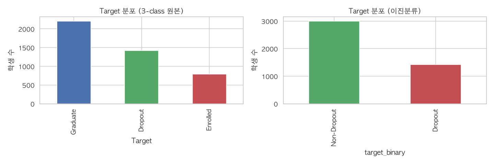
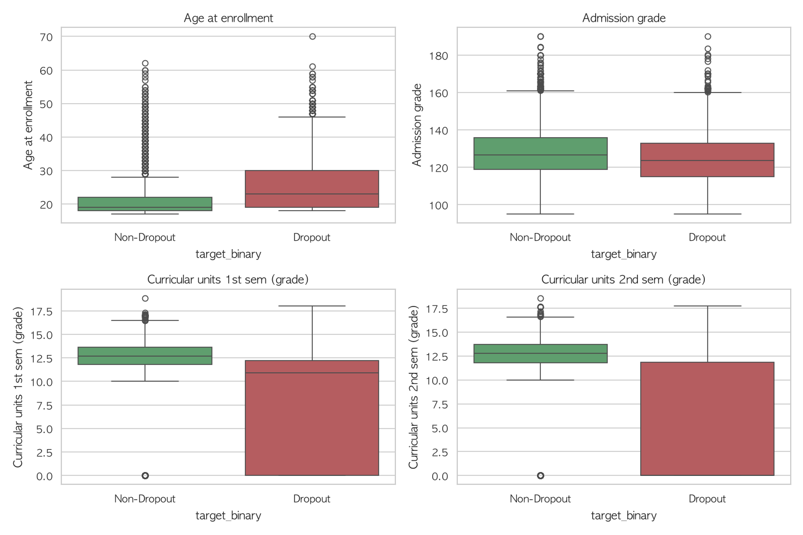
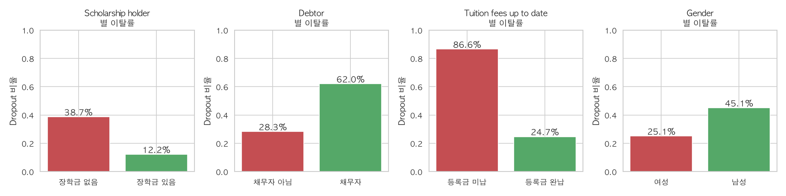
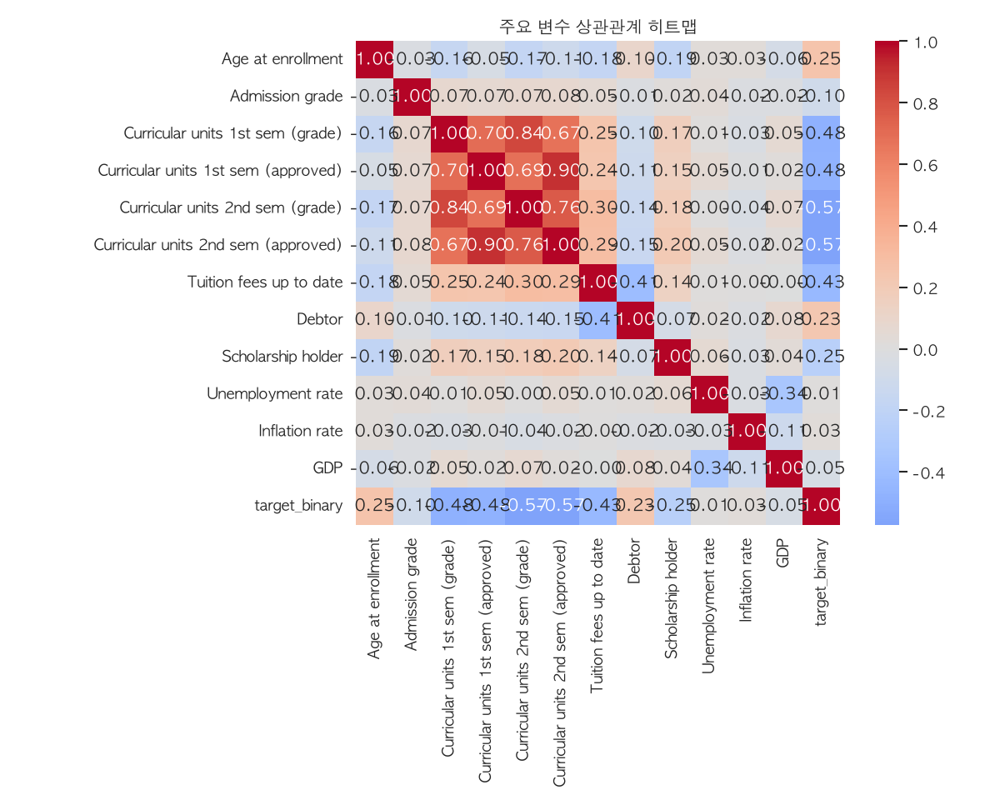
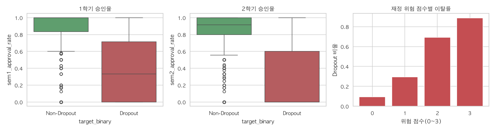

# EDA 결과서 : 대학생 중도탈락(Dropout) 예측

- **데이터**: UCI Predict Students' Dropout and Academic Success (4,424행 × 37열)
- **분석 노트북**: [`notebooks/01_eda.ipynb`](../notebooks/01_eda.ipynb)
- **Target 정의**: Dropout(1) vs Non-Dropout(0, Graduate+Enrolled) — 이진분류

---
### 1. 데이터 개요

| 항목 | 값 |
|---|---|
| 행 x 열 | 4,424 x 37 |
| 결측치 | 0개 |
| 중복행 | 0개 |

결측치·중복이 없는 정제된 데이터로, 별도의 결측치 대체(imputation)는 필요하지 않다.

---

### 2. Target 분포

| 클래스 | 인원 | 비율 |
|---|---|---|
| Graduate | 2,209 | 49.9% |
| Dropout | 1,421 | 32.1% |
| Enrolled | 794 | 18.0% |

이진분류 기준으로는 **Non-Dropout 67.9% : Dropout 32.1%** (약 2:1)로, 심각한 수준은 아니지만 모델 학습 시 `class_weight` 또는 threshold 조정 등 불균형 대응이 필요한 수준이다.

---

### 3. 주요 연속형 변수 분포 (Target별 비교)

1·2학기 평점 모두 Dropout 그룹에서 중앙값이 뚜렷하게 낮고, 특히 2학기 평점이 0점(과목을 아예 이수하지 못한 경우)에 몰려있는 학생 다수가 Dropout 그룹에 속한다. 입학 성적(Admission grade)은 두 그룹 간 차이가 상대적으로 작아, "입학 시점 성적"보다 "재학 중 성과"가 이탈에 더 직접적인 영향을 준다는 것을 시사한다.

---

### 4. 범주형/이진 변수별 이탈률 비교

| 구분 | 이탈률 |
|---|---|
| 장학금 없음 | 38.7% |
| 장학금 있음 | 12.2% |
| 채무자 아님 | 28.3% |
| 채무자 | 62.0% |
| **등록금 미납** | **86.6%** |
| 등록금 완납 | 24.7% |
| Gender=0 | 25.1% |
| Gender=1 | 45.1% |

**등록금 미납 그룹의 이탈률이 86.6%로, 완납 그룹(24.7%)의 3배가 넘는다** — 재정 상태가 이탈을 가장 극명하게 가르는 요인 중 하나임을 확인했다.   
장학금·채무 여부도 동일한 방향으로 뚜렷한 차이를 보인다. 성별 간에도 20%p 차이가 있으나, **Gender 코드(0/1)와 실제 성별(남/여) 매핑은 UCI 공식 변수표로 재확인이 필요**하다(현재 문헌상 1=남성, 0=여성으로 알려져 있으나 본 보고서에서는 코드값 기준으로만 기재)

---

### 5. 상관관계 (주요 변수 vs Target)

| 변수 | 상관계수 |
|---|---|
| 2학기 평점 | -0.572 |
| 2학기 이수과목 수 | -0.570 |
| 1학기 평점 | -0.481 |
| 1학기 이수과목 수 | -0.479 |
| 등록금 완납 여부 | -0.429 |
| 입학 나이 | +0.254 |
| 장학금 여부 | -0.245 |
| 채무자 여부 | +0.229 |
| 입학 성적 | -0.096 |
| GDP | -0.046 |
| 물가상승률 | +0.028 |
| 실업률 | +0.013 |

**학업 성취도**(평점·이수과목) 계열과 **재정 상태**(등록금·장학금·채무) 계열이 가장 강한 신호이며, **거시경제 지표(실업률/물가/GDP)는 개인 단위 예측에 거의 도움이 되지 않는다.  
이는 집계 단위(지역·시기)의 효과이지 개별 학생의 특성이 아니기 때문으로 추정된다.

---

### 6. 파생변수 후보 검증: 학기별 승인율 & 재정 위험 점수

| 변수 | 상관계수 |
|---|---|
| 1학기 승인율 (합격/등록) | -0.591 |
| 2학기 승인율 (합격/등록) | **-0.659** (전체 변수 중 최강) |
| 재정 위험 점수 (0~3점) | +0.435 |

#### 재정 위험 점수별 이탈률

| 위험 점수 | 이탈률 |
|---|---|
| 0 (위험요인 없음) | 9.3% |
| 1 | 29.3% |
| 2 | 69.2% |
| 3 (모두 해당) | 88.8% |

승인율은 원본 성적·이수과목 수보다 더 강한 신호로 확인되었고(등록 대비 통과 비율이라는 정규화 효과), 재정 위험 점수는 요인 개수에 거의 선형적으로 비례해 이탈률이 증가한다. 두 변수 모두 전처리 단계의 파생변수로 채택할 근거가 충분하다.

---

### 7. 이상치·특이 케이스: 1학기 미등록 학생

| 구분 | 인원 | 이탈률 |
|---|---|---|
| 1학기 정상 등록 | 4,244명 (95.9%) | 31.7% |
| **1학기 등록과목 0개** | **180명 (4.1%)** | **42.8%** |

1학기에 과목을 하나도 등록하지 않은 학생은 소수(4.1%)이지만 이탈률이 11%p 더 높다.   
표본이 적어 단순 상관계수로는 약하게(0.047) 측정되지만(이는 값이 한쪽으로 쏠린 이진 변수의 상관계수가 구조적으로 낮게 나오는 현상이며 실제 신호가 없다는 뜻은 아님),  
실제 이탈률 차이는 뚜렷해 트리 기반 모델(Random Forest, XGBoost 등)에서는 유의미한 분기 기준으로 활용될 수 있다.

---

### 8. Marital Status 분포 (참고)

88.6%가 코드 1(미혼 추정)에 쏠려있어, 이 컬럼 단독으로는 변별력이 낮을 수 있다.  
원-핫 인코딩 시 나머지 카테고리들은 자연스럽게 저빈도 처리된다.

---

## 종합 인사이트 요약

1. **가장 강력한 이탈 신호는 학업 성취도**
    * 학기별 승인율(2학기 -0.659)이 원본 성적·이수과목 수보다도 강한 단일 최고 예측 변수.
2. **재정 상태가 가장 극적인 신호**
    * 등록금 미납 시 이탈률 86.6%, 재정 위험 요인 0→3개로 갈수록 이탈률 9.3%→88.8%로 거의 선형 증가.
3. **거시경제 지표는 개인 단위 예측에 거의 무의미**
    * 실업률/물가/GDP 상관계수 모두 0.05 미만.
4. **소수 특이 케이스도 신호 있음**
    * 1학기 미등록 학생(4.1%)의 이탈률이 11%p 더 높음. 상관계수만으로 변수 가치를 판단하지 않아야 함.
5. **모델링 방향 제안**
    * 학업성취도·재정상태 계열 피처를 핵심 축으로 사용, 클래스 불균형(32:68)에 대한 `class_weight` 또는 threshold 튜닝 필요.

## 전처리와의 연결

본 EDA에서 확인된 인사이트는 [`notebooks/preprocess.ipynb`](../notebooks/preprocess.ipynb)의 파생변수 설계에 이미 반영되어 있다:
- `sem1_approval_rate`, `sem2_approval_rate` — 학기별 승인율
- `financial_risk_score` — 재정 위험 점수(0~3)
- `grade_change` — 성적 변화량(2학기-1학기)
- `zero_enrolled_1st_sem` — 1학기 미등록 플래그

전처리된 데이터(`data/processed/train.csv`, `val.csv`, `test.csv`)와 전처리 파이프라인(`models/preprocessor.joblib`)은 모델링 단계에서 바로 사용 가능하다.
